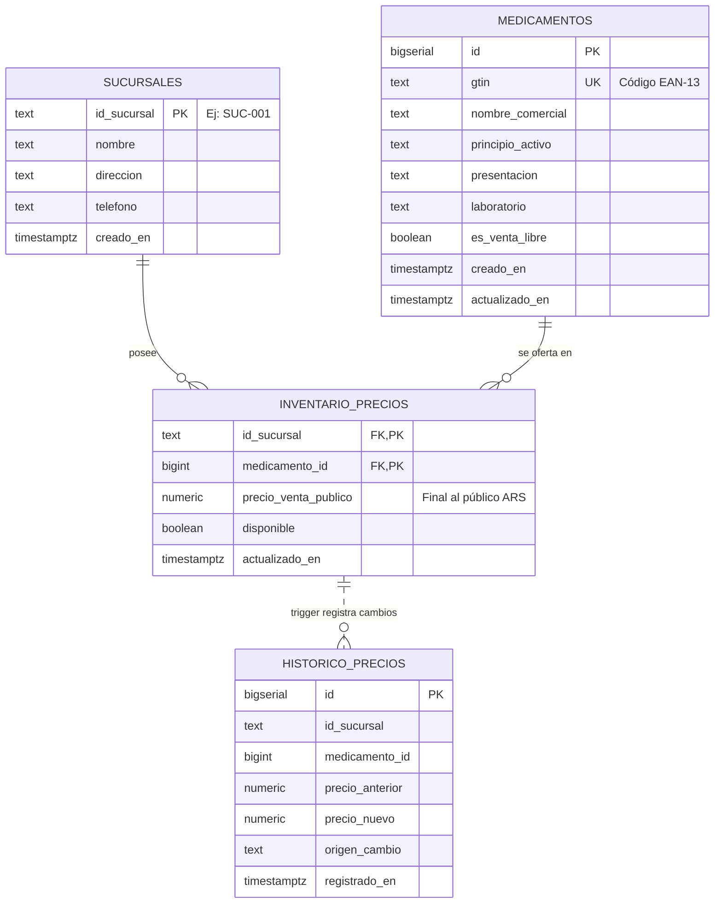

# Arquitectura del Sistema — Lista de Precios (Res. Conjunta 2/2025)

## 1. Visión general

La farmacia importa listas CSV desde el panel administrativo o su ERP. La API
valida y persiste los datos en PostgreSQL; el público consulta los precios
desde una página web o desde el QR de un cartel PDF.

```mermaid
flowchart LR
  ERP[ERP de farmacia]
  Admin[Operador administrativo]
  Cliente[Cliente]

  subgraph UI[Interfaz web estática]
    Panel[Panel admin<br/>previsualización y validación]
    Publica[Página pública<br/>búsqueda y filtros locales]
    BrowserStore[(localStorage del navegador<br/>sucursal y clave del panel)]
  end

  subgraph API[API Fastify]
    Upload[POST precios/csv<br/>autenticación si ADMIN_API_KEY está configurada]
    Csv[Parser CSV, validación<br/>y upserts transaccionales]
    Prices[GET precios<br/>consulta parametrizada]
    Poster[GET cartel.pdf<br/>PDFKit + generación QR]
  end

  DB[(PostgreSQL<br/>DATABASE_URL<br/>sucursales, medicamentos,<br/>inventario_precios, historico_precios)]
  QR[QR impreso<br/>URL pública por sucursal]

  ERP -->|Archivo CSV| Panel
  ERP -->|CSV por HTTP| Upload
  Admin -->|Selecciona CSV y sucursal| Panel
  Panel -.->|Preferencias locales, no datos de precios| BrowserStore
  Panel -->|multipart/form-data o text/csv| Upload
  Upload --> Csv
  Csv -->|BEGIN, UPSERT, COMMIT / ROLLBACK| DB
  DB -->|Trigger audita cambios de precio| DB

  Cliente -->|Escanea| QR
  QR -->|Abre URL con sucursal| Publica
  Publica -->|GET /api/sucursales/{id_sucursal}/precios| Prices
  Prices -->|SELECT de sucursal y productos disponibles| DB
  DB -->|Filas de precios| Prices
  Prices -->|JSON| Publica
  Publica -->|Lista filtrable| Cliente

  Admin -->|Solicita cartel de sucursal| Poster
  Poster -->|Lee nombre de sucursal| DB
  Poster -->|Genera PDF con QR a la página pública| QR
  Poster -->|application/pdf| Admin

  classDef traditional fill:#e8f2ff,stroke:#3973a8,color:#142b40
  classDef persistent fill:#fff3d6,stroke:#a87816,color:#382b0d
  class Upload,Csv,Prices,Poster traditional
  class DB,BrowserStore persistent
```

**IA y agentes:** el sistema no integra modelos ni componentes de inteligencia
artificial. El procesamiento CSV, las consultas y la generación PDF/QR son
lógica tradicional determinista. Tampoco existe orquestación multi-agente, así
que no hay decisiones, mensajes ni ciclo de agentes que diagramar.

**Persistencia:** PostgreSQL, configurado con `DATABASE_URL`, es la memoria
persistente de los datos de negocio y su auditoría. El `localStorage` del
navegador conserva solamente la sucursal y la clave introducidas en el panel
administrativo; no es almacenamiento de precios ni memoria de IA. La ubicación
del servicio de base de datos y del frontend/backend depende del despliegue.

## 2. Modelo de datos (ER)



La relación punteada con `HISTORICO_PRECIOS` representa el efecto del trigger,
no una clave foránea: esa tabla no declara FKs en el esquema SQL.

### Decisiones clave

- **GTIN como llave de negocio** (`UNIQUE`): los ERPs exportan códigos de barra;
  el `ON CONFLICT (gtin)` hace idempotente cada importación.
- **Precio por sucursal**: la tabla puente `inventario_precios` permite listas
  distintas por punto de venta sin duplicar el catálogo.
- **Auditoría por trigger** `auditar_cambio_precio`: cualquier cambio efectivo
  de `precio_venta_publico` queda registrado en `historico_precios` dentro de
  la misma transacción (trazabilidad ante fiscalización).
- **Índices GIN trgm** (`pg_trgm`) sobre `nombre_comercial` y `principio_activo`:
  aceleran `ILIKE '%término%'` del buscador público.

## 3. Diagrama de secuencia UML (flujos de datos)

```mermaid
sequenceDiagram
    autonumber
    actor Farmacia as Operador / ERP de farmacia
    participant Admin as Panel administrativo
    participant API as API Fastify
    participant CSV as Servicio de importación CSV
    participant DB as PostgreSQL (DATABASE_URL)
    actor Cliente as Cliente
    participant Front as Página pública
    participant PDF as Servicio PDF/QR

    rect rgb(235, 245, 255)
    note over Farmacia, DB: FLUJO 1: Importación de precios (lógica tradicional)
    Farmacia->>Admin: Selecciona CSV y sucursal
    Admin->>Admin: Previsualiza y valida campos básicos
    Admin->>API: POST /api/sucursales/{id_sucursal}/precios/csv
    Note over Admin,API: multipart/form-data o text/csv; x-api-key o Bearer si ADMIN_API_KEY está configurada
    API->>CSV: Valida sucursal y procesa stream
    CSV->>DB: BEGIN; crea sucursal si falta; UPSERT por lotes
    DB->>DB: Trigger guarda cambios de precio en historico_precios
    alt CSV válido
      CSV->>DB: COMMIT
      API-->>Admin: 200 con resultado de importación
    else CSV inválido o falla de importación
      CSV->>DB: ROLLBACK
      API-->>Admin: Error de importación
    end
    end

    rect rgb(240, 255, 240)
    note over Cliente, DB: FLUJO 2: Consulta pública por QR
    Cliente->>Front: Abre URL de sucursal desde el QR
    Front->>API: GET /api/sucursales/{id_sucursal}/precios?limit=1000
    API->>DB: SELECT sucursal y productos disponibles
    DB-->>API: Sucursal y filas de precios
    API-->>Front: JSON con precios y paginación
    Front->>Front: Aplica búsqueda y filtros locales
    Front-->>Cliente: Muestra lista pública de precios
    end

    rect rgb(255, 245, 230)
    note over Farmacia, PDF: FLUJO 3: Generación del cartel PDF
    Farmacia->>API: GET /api/sucursales/{id_sucursal}/cartel.pdf
    API->>DB: Consulta nombre de sucursal
    DB-->>API: Nombre de sucursal
    API->>PDF: Genera cartel y QR con URL pública
    PDF-->>API: Buffer application/pdf
    API-->>Farmacia: Cartel PDF
    end
```

## 4. Flujo 1 en detalle — Ingesta masiva de precios

1. El ERP de la farmacia exporta un CSV y lo envía por HTTP (multipart o body
   crudo `text/csv`) al endpoint de carga.
2. `csvService.ts` procesa el archivo **en streaming** (`csv-parser`), lote a
   lote (500 filas), **dentro de una única transacción**:
   - `INSERT ... ON CONFLICT (gtin) DO UPDATE` para el catálogo.
   - `INSERT ... ON CONFLICT (id_sucursal, medicamento_id) DO UPDATE` para precios.
3. Si **una sola línea es inválida**, se lanza error → `ROLLBACK` completo →
   la base queda exactamente como antes (atomicidad).
4. Al confirmar (`COMMIT`), el trigger registra en histórico solo las filas
   cuyo precio realmente cambió.

## 5. Flujo 2 en detalle — Consulta pública

1. El cartel impreso contiene un QR hacia `{PUBLIC_APP_URL}/?sucursal=SUC-001`;
  si no se configura, el generador usa `http://localhost:5500`.
2. La SPA React lee `?sucursal=`, descarga **una vez** hasta 1000 productos y
   filtra localmente (búsqueda instantánea con debounce de 180 ms, sin
   acentos, por marca o droga) + filtro Bajo receta / Venta libre.
3. Precios formateados con `Intl.NumberFormat('es-AR', { currency: 'ARS' })`.
4. Pie de página normativo permanente.

## 6. Seguridad y buenas prácticas aplicadas

- Consultas siempre parametrizadas (sin concatenación SQL).
- **`ADMIN_API_KEY`**: si está configurada, el endpoint de carga exige `x-api-key` (o
  `Authorization: Bearer`) y compara la clave en tiempo constante. Si no está configurada,
  la carga queda sin autenticación; el servidor emite una advertencia en producción.
  Los GET públicos no requieren autenticación.
- CORS se configura con `ALLOWED_ORIGINS`; vacío o `*` permite cualquier origen y una
  lista de orígenes restringe el acceso.
- Límite de tamaño de carga: 64 MB; validación de `id_sucursal` por regex.
- RLS habilitado en las 4 tablas, sin políticas públicas. La API se conecta con el rol
  dueño de las tablas, que omite RLS; no depende de la Data API de Supabase.
- Credenciales únicamente vía variables de entorno (`.env`, nunca en el repo).
- SSL de PostgreSQL configurable con `DATABASE_SSL` y autodetectado para conexiones
  remotas; apagado graceful del servidor ante `SIGINT`/`SIGTERM`.

## 7. Escalado futuro

- Paginación server-side ya soportada (`?page=&limit=`) si el catálogo crece.
- `historico_precios` permite gráficos de evolución o reportes de variación.
- Multi-cadena: `sucursales` puede extenderse con `cadena_id` sin breaking changes.
