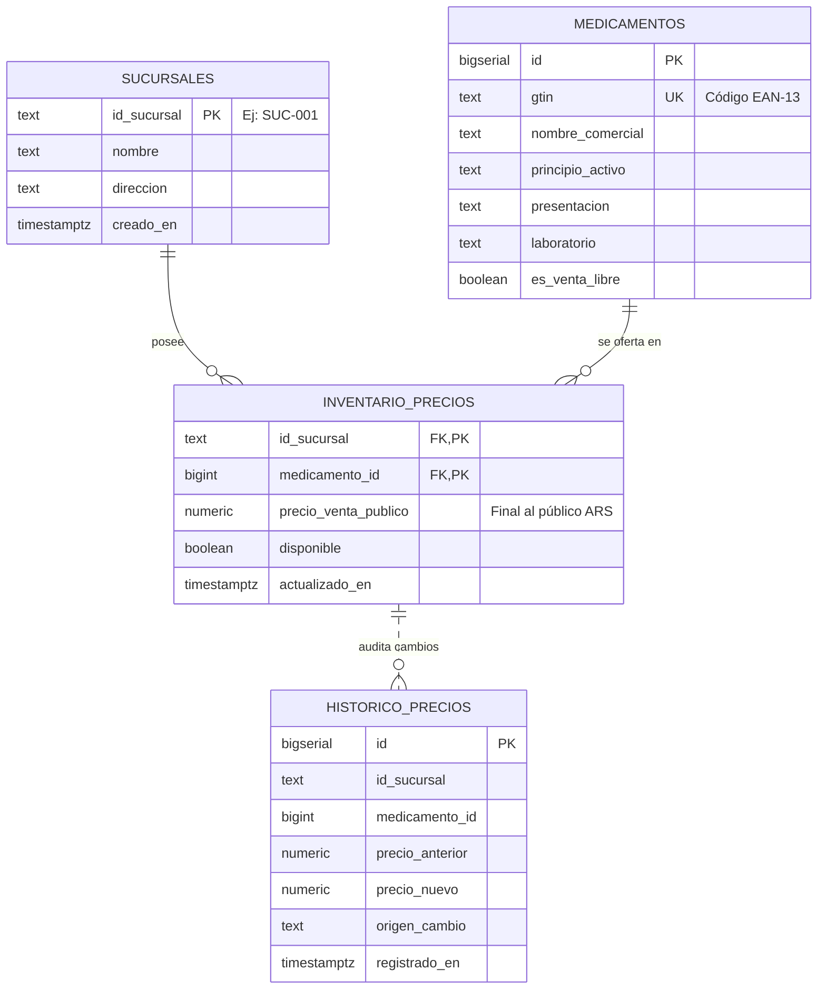
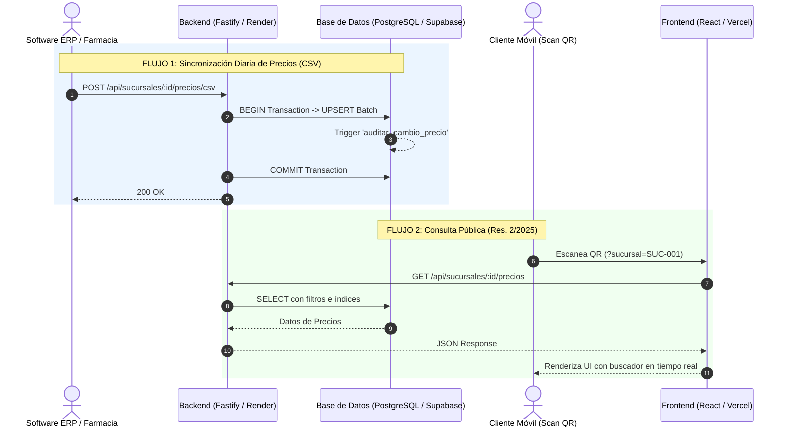

# Arquitectura del Sistema — Lista de Precios (Res. Conjunta 2/2025)

## 1. Visión general

Sistema de tres capas que permite a las farmacias cumplir con la obligación de
tener la lista de precios de medicamentos **de venta bajo receta humana**
disponible al público mediante un código QR con la leyenda exacta:
**"CONSULTE AQUÍ LISTA DE PRECIOS DE MEDICAMENTOS"**.

| Capa     | Tecnología                    | Hosting sugerido   |
|----------|-------------------------------|--------------------|
| Frontend | React 18 + Tailwind (SPA)     | Vercel / Netlify   |
| Backend  | Fastify 5 + TypeScript        | Render             |
| Datos    | PostgreSQL (Supabase)         | Supabase (sa-east) |

```
┌──────────────┐    CSV diario    ┌──────────────────┐   SQL/UPSERT   ┌──────────────┐
│  ERP Farma   │ ───────────────► │ API Fastify      │ ─────────────► │ PostgreSQL   │
│  (farmacia)  │                  │ (Render)         │                │ (Supabase)   │
└──────────────┘                  │  · upload.ts     │                │  · trigger   │
                                  │  · prices.ts     │ ◄───────────── │    auditoría │
┌──────────────┐   HTTPS/JSON     │  · pdfService.ts │    SELECT      └──────────────┘
│ QR → Celular │ ───────────────► │                  │
│ (cliente)    │                  └──────────────────┘
└──────▲───────┘                          ▲
       │ escanea                          │ sirve SPA estática
       │                                  │
       └────────────── Vercel/Netlify ────┘
```

## 2. Modelo de datos (ER)



### Decisiones clave

- **GTIN como llave de negocio** (`UNIQUE`): los ERPs exportan códigos de barra;
  el `ON CONFLICT (gtin)` hace idempotente cada importación.
- **Precio por sucursal**: la tabla puente `inventario_precios` permite listas
  distintas por punto de venta sin duplicar el catálogo.
- **Auditoría por trigger** `auditar_cambio_precio`: cualquier cambio efectivo
  de `precio_venta_publico` queda registrado en `historico_precios` dentro de
  la misma transacción (trazabilidad ante fiscalización).
- **Índices GIN trgm** (`pg_trgm`) sobre `nombre_comercial` y `principio_activo`:
  aceleran `ILIKE '%término%'` del buscador público.

## 3. Diagrama de secuencia UML (flujos de datos)



## 4. Flujo 1 en detalle — Ingesta masiva de precios

1. El ERP de la farmacia exporta un CSV y lo envía por HTTP (multipart o body
   crudo `text/csv`) al endpoint de carga.
2. `csvService.ts` procesa el archivo **en streaming** (`csv-parser`), lote a
   lote (500 filas), **dentro de una única transacción**:
   - `INSERT ... ON CONFLICT (gtin) DO UPDATE` para el catálogo.
   - `INSERT ... ON CONFLICT (id_sucursal, medicamento_id) DO UPDATE` para precios.
3. Si **una sola línea es inválida**, se lanza error → `ROLLBACK` completo →
   la base queda exactamente como antes (atomicidad).
4. Al confirmar (`COMMIT`), el trigger registra en histórico solo las filas
   cuyo precio realmente cambió.

## 5. Flujo 2 en detalle — Consulta pública

1. El cartel impreso contiene un QR hacia `https://frontend/?sucursal=SUC-001`.
2. La SPA React lee `?sucursal=`, descarga **una vez** hasta 1000 productos y
   filtra localmente (búsqueda instantánea con debounce de 180 ms, sin
   acentos, por marca o droga) + filtro Bajo receta / Venta libre.
3. Precios formateados con `Intl.NumberFormat('es-AR', { currency: 'ARS' })`.
4. Pie de página normativo permanente.

## 6. Seguridad y buenas prácticas aplicadas

- Consultas siempre parametrizadas (sin concatenación SQL).
- **`ADMIN_API_KEY`**: el endpoint de carga exige `x-api-key` (o `Authorization: Bearer`),
  con comparación en tiempo constante; los GET públicos quedan abiertos por normativa.
- CORS restringido por variable `ALLOWED_ORIGINS`.
- Límite de tamaño de carga: 64 MB; validación de `id_sucursal` por regex.
- RLS habilitado en las 4 tablas: la Data API de Supabase queda bloqueada para terceros.
- Credenciales únicamente vía variables de entorno (`.env`, nunca en el repo).
- SSL automático contra Supabase; apagado graceful (SIGINT/SIGTERM).

## 7. Escalado futuro

- Paginación server-side ya soportada (`?page=&limit=`) si el catálogo crece.
- `historico_precios` permite gráficos de evolución o reportes de variación.
- Multi-cadena: `sucursales` puede extenderse con `cadena_id` sin breaking changes.
